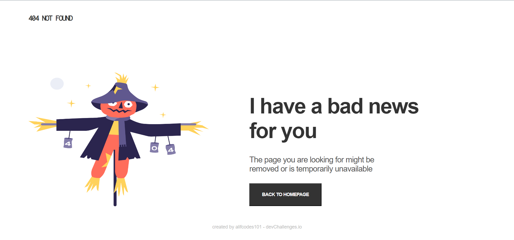

<h1 align="center">404 Not Found
</h1>

   Solution for a challenge from  <a href="http://devchallenges.io" target="_blank">Devchallenges.io</a>.

  <h3>
    <a href="https://alifcodes101.github.io/404-not-found/">
      Demo
    </a>
     | 
    <a href="https://github.com/alifcodes101/404-not-found">
      Solution
    </a>
     | 
    <a href="https://devchallenges.io/challenges/wBunSb7FPrIepJZAg0sY">
      Challenge
    </a>
  </h3>

## Table of Contents

- [Overview](#overview)
  - [Built With](#built-with)
- [Features](#features)
- [Contact](#contact)

## Overview

- You can see the demo by going to <a href="https://alifcodes101.github.io/404-not-found/">
      link
    </a>
- It was fun and great learning experience
- Improved a little bit on HTML and CSS

### Built With

- HTML
- CSS

## Features

This site was created as a submission to a [DevChallenges](https://devchallenges.io/paths/responsive-web-developer) challenge. The [challenge](https://devchallenges.io/challenges/wBunSb7FPrIepJZAg0sY) was to build a site to complete the given user stories.

## Contact

- GitHub [@alifcodes101](https://github.com/alifcodes101)
- Twitter [@abeshiqbal](https://twitter.com/abesh_iqbal)
